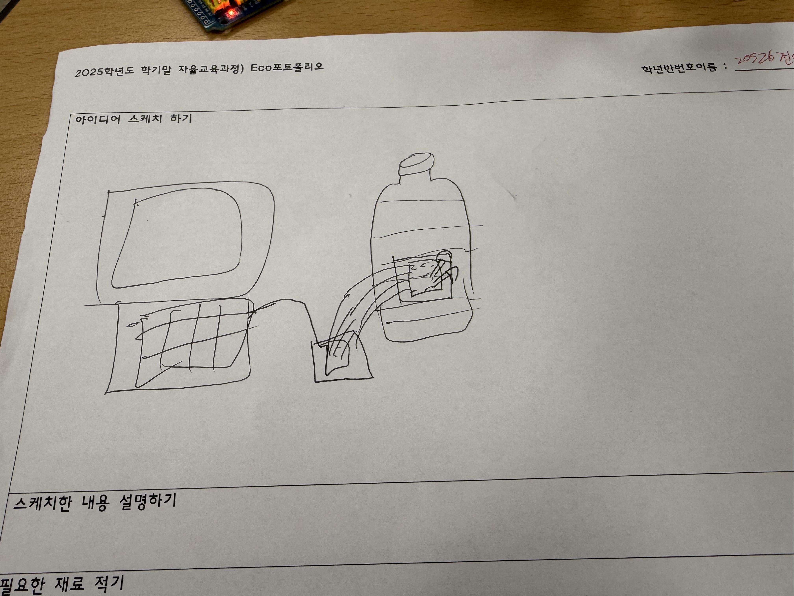
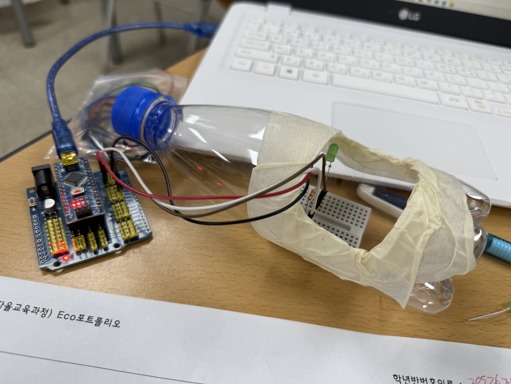

# 🌱 에코아트 프로젝트: [작품명]
무드등
## 📖 프로젝트 개요
- **제작자**: [전이준]
- **제작일**: [7월16일]
- **소개**
> 우리 작품이 어떤 환경 문제를 다루고 있는지, 어떤 메시지를 전달하고 싶은지 자유롭게 설명해주세요.
> (예: 저희는 버려지는 플라스틱 쓰레기 문제의 심각성을 알리기 위해...)
버려지는 플라스틱들을 다시의미있게 사용하기위해 무드등으로 사용하였다
## 📦 사용 재료
- 아두이노, 온도센서, LED, 브레드보드
- 페트병, 그림 도안 등
페트병.가위
## 🔧 제작 과정

### 1단계: 아이디어 스케치

- 아이디어 설명
- 예상 완성도

### 2단계: 완성품

배를 표현한 것입니다
## 💭 제작 후기
### 잘된 점
- 계확한것과 일치하게 완성하였다

### 아쉬운 점
- 열심히했지만 작품이 멋이없는것 같다

### 개선할 점
- 생각보다 잘나와서 없다

### 내가 이미 알고 있었던 것
- 환경오염이 심각하다는것

### 새롭게 배운게 된 것
- 아두이노와 ECO Art에 대해 알게되었다

### 더 알고 싶은 것
- 다른 eco art작품과 아두이노에 대해 알아보고싶다

## 🌍 환경적 의미
- 이 작품이 환경에 미치는 긍정적 영향
- 사용한 재활용 재료가 환경에 미치는 의미
- 앞으로의 환경 보호 다짐 등
플라스틱을 의미있게 재활용 할수있다
## 📚 참고 자료
- [환경 관련 웹사이트](링크)
- [참고한 에코아트 작품](링크)

## 🏷️ 태그
#에코아트 #재활용 #환경보호 #DIY #창의활동

---

> 이 프로젝트는 환경 보호와 창의적 사고를 위한 교육 목적으로 제작되었습니다.
